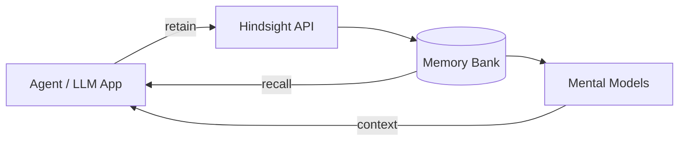
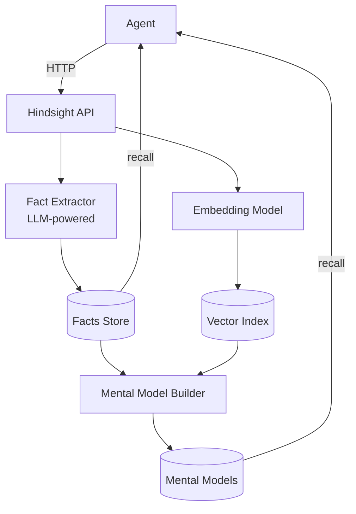
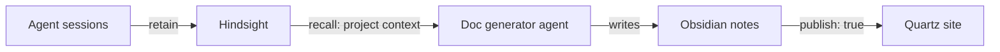

# Hindsight — Agentic Memory for AI Systems

> [!tldr] TL;DR
> Hindsight gives AI agents persistent, structured memory. Drop it in front of any LLM, and your agent stops forgetting everything between sessions. It's open, self-hostable, and built for production.

## The Problem It Solves

Every AI agent starts fresh. Context windows reset. Sessions end. The user explains themselves again and again.

This is the [[Memory Systems for AI Agents|memory problem]] at its most frustrating — not a technical limitation, just a missing architectural layer.

Hindsight is that layer.



## How It Works

### Retain
At the end of a session (or continuously), your agent sends conversation chunks to Hindsight:

```http
POST /v1/retain
{
  "bank": "agentshadow",
  "content": "User prefers concise replies. Working on Quartz publishing pipeline.",
  "tags": ["preferences", "projects"]
}
```

Hindsight extracts facts, scores them by importance, and stores them with embeddings.

### Recall
Before responding, your agent queries Hindsight for relevant context:

```http
POST /v1/recall
{
  "bank": "agentshadow",
  "query": "What is the user working on?",
  "limit": 10
}
```

Returns ranked, relevant facts — ready to inject into context.

### Mental Models
Hindsight doesn't just store raw facts. It periodically synthesises them into **mental models** — structured summaries of what it knows about a topic, user, or project.

> [!example] Example mental model output
> **User Preferences**: Prefers direct answers without filler. Technical background in AI architecture. Based in Sweden (CEST). Uses Telegram as primary interface.

These mental models are available as rich context chunks, dramatically reducing the tokens needed to reconstruct prior knowledge.

## Architecture

> [!info] Self-hostable
> Hindsight runs as a Docker container. Your memories stay on your infrastructure — no data leaves your network unless you configure a cloud endpoint.



### Key Components

| Component | Role |
|-----------|------|
| Fact extractor | LLM call that distills conversation into discrete facts |
| Embedding model | Converts facts to vectors for semantic search |
| Reranker | Cross-encoder that rescores retrieval results for precision |
| Mental model builder | Periodic synthesis of facts into coherent summaries |
| Memory bank | Isolated namespace — one per agent, user, or project |

## Multi-Bank Architecture

Hindsight supports multiple isolated memory banks. You can scope memory by:

- **Agent** — `bank: agentshadow` for this agent's global memory
- **Project** — `bank: project-quartz` for project-specific context
- **User** — `bank: user-kent` for per-user personalisation in multi-tenant apps

> [!tip] Cross-agent memory
> Multiple agents can share a bank. An agent that handles email and an agent that handles calendar can both read/write to `bank: kent-global` — building a shared picture of the user across surfaces.

## Performance Considerations

> [!warning] Reranker latency on edge hardware
> The default cross-encoder reranker (`cross-encoder/ms-marco-MiniLM-L-6-v2`) runs CPU-bound PyTorch inference locally. On ARM/Pi-class hardware, `/recall` with `include_chunks: true` can take 5–10s due to the reranker processing 100+ facts.
>
> **Options:**
> - Disable the reranker for low-latency recall (slight quality drop)
> - Run Hindsight on x86 hardware
> - Use a remote reranker API (Cohere, Jina)

## Generating Docs from Hindsight

One of the more interesting use cases: **using Hindsight as the source of truth for auto-generated documentation**.

The pattern:



Every decision, architecture choice, and lesson learned gets retained in Hindsight. A doc-generation agent periodically recalls the project context and writes or updates notes. Those notes flow through the publishing pipeline to the live site — automatically.

This is the loop we're building here.

## Anyone Can Use This

Hindsight is not tied to any specific agent framework. It's a plain HTTP API.

| Integration | Status |
|-------------|--------|
| OpenClaw plugin | ✅ `@vectorize-io/hindsight-openclaw` |
| Oh My Pi (OMP) | ✅ Native integration |
| LangChain | 🔧 Via HTTP tool |
| Custom agent | ✅ Direct API calls |
| Self-hosted Docker | ✅ Full support |

> [!note] Want to build on top of this?
> The combination of Hindsight + Quartz is essentially a **self-documenting AI agent** — it remembers everything and publishes what matters. The infrastructure to build this for your own agent is all here.

## Related

- [[Memory Systems for AI Agents]] — the theory behind the four memory types
- [[RAG Architecture Patterns]] — how retrieval works under the hood
- [[Context Engineering - The New Prompt Engineering]] — where memory fits in the broader picture
- [[Context Window Limits - Strategies for Long Documents]] — managing what gets recalled into context
