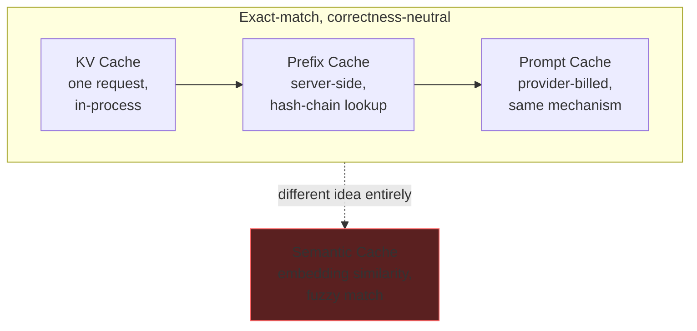
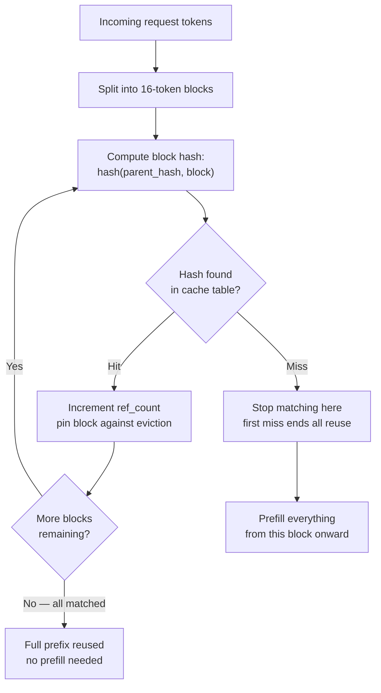
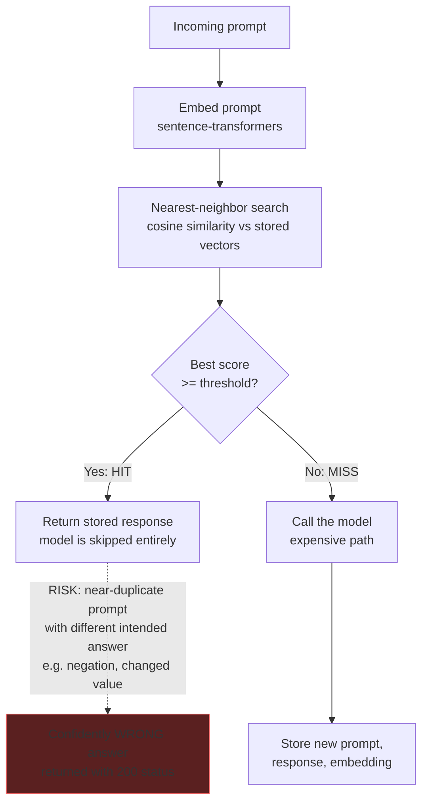

# KV, Prefix, Prompt and Semantic Caching in LLMs — Clearly Explained

> [!tldr] TL;DR
> Four different things in an LLM system all get called "caching," and they're not the same:
> - **KV cache** — while the model is answering you, it saves its own intermediate work so it doesn't redo it for every new word it generates.
> - **Prefix caching** — the server keeps that saved work around *after* your request finishes, so if the next request starts with the exact same text, it can skip straight to the new part.
> - **Prompt caching** — the same idea, but as a paid API feature: providers like Anthropic/OpenAI charge less to reuse a cached prompt (~10% of normal price) and a bit more to store it the first time (~125%).
> - **Semantic caching** — a completely different animal: instead of matching exact text, it matches *meaning* (via embeddings) and hands back a previously stored answer if a new question looks similar enough.
>
> The first three are **exact-match**: if they don't hit, you just pay full price — never a wrong answer. Semantic caching is **fuzzy-match** — a near-miss can confidently return the *wrong* stored answer and still look successful. There's also a fifth, lesser-used layer: an exact byte-identical response cache, which has none of semantic caching's risk.
>
> **Biggest practical rule:** keep unchanging text (system instructions) at the start of your prompt and put anything that changes (timestamps, user IDs) at the end — otherwise you invalidate the whole cache on every request.
>
> **The single most actionable production rule:** put stable content first and variable content (timestamps, request IDs, user names) last in the prompt — anything variable placed early invalidates every cache block that comes after it.

## 1) The KV cache

Four things in an LLM stack store four different objects, and all of them get called caching.

- The **KV cache** stores attention tensors for one request.
- **Prefix caching** stores those same tensors on the server, keyed by a hash chain over token IDs.
- **Prompt caching** is the provider's billed version of that same lookup, at 0.1x the base input rate on a read against a 1.25x premium on the write.
- A **semantic cache** stores finished response strings, keyed by cosine similarity over an embedding.

The first three are exact-match and correctness-neutral, so a miss costs you money and latency. The fourth is fuzzy-match, and it will hand you a wrong answer with a 200.

So this note goes through all four: what each one stores, and what quietly breaks it.

!attachments/kv-prefix-prompt-and-semantic-caching-in-llms-clearly-explained/image-36.png

Everything in the source article runs on one machine, CPU included, with a 360M parameter model. There is also one Anthropic API example and one small semantic cache built on sentence-transformers. Where a mechanism only exists inside a serving engine (like vLLM), the article walks the logic in pseudocode rather than pretending it's reproducible on a laptop.

Note: the cache API changed shape in `transformers` v5, so snippets below assume v5+. On v4, the equivalents are `DynamicCache()` with no config argument and `torch_dtype=` instead of `dtype=`.

```bash
pip install "transformers>=5.0" torch

# only for the quantized cache example
pip install optimum-quanto

# only for the semantic cache example
pip install sentence-transformers

# only for the prompt caching example
pip install anthropic
```

### Why only K/V get cached

During **prefill**, the model computes a key and value vector for every prompt token at every layer and stores them. Decoding then attends over those stored vectors and appends one new pair per generated token, instead of recomputing the whole sequence each step.

Queries don't get cached, and the reason is **causal masking**. A token's query vector is used once, at the step that token is processed, and never read again. Its key and value are read by every token that comes after it, so those are the two most important vectors to save.

Without storing them, each decode step requires a matrix-matrix multiply over the full sequence generated so far. With the cache, the step becomes a matrix-vector multiply over one new token — far fewer FLOPs.

!attachments/kv-prefix-prompt-and-semantic-caching-in-llms-clearly-explained/image-37.png

While this reduces the computation on each token, you have to load the entire cache from HBM on every single step, so decode is no longer compute-bound but rather becomes **memory-bandwidth-bound**. Attention kernels finish faster than the cache can be streamed in, and the GPU spends most of a decode step waiting on memory.

!attachments/kv-prefix-prompt-and-semantic-caching-in-llms-clearly-explained/image-38.png

The video below depicts LLM inference with and without KV caching:

!attachments/kv-prefix-prompt-and-semantic-caching-in-llms-clearly-explained/kv-caching-final.mp4

### KV cache growth with each token

The `transformers` library exposes the cache as a first-class object, so you can hold it, inspect it, and pass it back in.

```python
import torch
from transformers import AutoTokenizer, AutoModelForCausalLM, DynamicCache

model_id = "HuggingFaceTB/SmolLM2-360M-Instruct"
tokenizer = AutoTokenizer.from_pretrained(model_id)
model = AutoModelForCausalLM.from_pretrained(
    model_id, dtype=torch.bfloat16, device_map="auto"
)

inputs = tokenizer("The capital of France is", return_tensors="pt")
inputs = inputs.to(model.device)

past_key_values = DynamicCache(config=model.config)

out = model.generate(
    **inputs,
    do_sample=False,
    max_new_tokens=20,
    past_key_values=past_key_values,
)

>>> print(tokenizer.decode(out[0], skip_special_tokens=True))
"""The capital of France is Paris. It is the largest city in
France and the second-largest city in the European Union."""

>>> print("prompt tokens: ", inputs["input_ids"].shape[1])
"prompt tokens: 5"

>>> print("total tokens: ", out.shape[1])
"total tokens: 25"

>>> print("cache length: ", past_key_values.get_seq_length())
"cache length: 24"
```

Normally, you invoke `generate` and the cache is created and destroyed internally, invisible to you. Here we construct a `DynamicCache` ourselves and hand it in, so we still hold a reference to it after generation finishes.

`get_seq_length()` reports how many token positions the cache holds. Running this, the output contains the prompt length plus tokens generated, minus one — the final token's key and value are computed but never attended over by anything.

This shows the cache holds one entry per token seen, growing by exactly one entry per decode step. `DynamicCache` is the default because it grows as generation proceeds rather than pre-allocating, so short requests don't reserve memory they will never use.

!attachments/kv-prefix-prompt-and-semantic-caching-in-llms-clearly-explained/image-39.png

### Memory math and mitigations

The cache decides how many requests can fit on a GPU. Its size is fixed by the model shape and grows linearly with token count, since every layer holds a key and value tensor for every KV head.

For a **70B model at BF16, a single 128K context holds around 40 GB of cache** — comparable to the entire model at 4-bit weights.

Ways to reduce this:
- **Grouped-query attention (GQA)** shares one key/value head across a group of query heads, shrinking the cache and raising FLOPs per byte of data loaded.
- **Multi-head latent attention (MLA)**, in the DeepSeek line, compresses the whole thing into a latent vector.
- **Cache quantization** trades a little numerical accuracy for roughly double the capacity, and `transformers` implements it:

```python
# requires: pip install optimum-quanto
out = model.generate(
    **inputs,
    do_sample=False,
    max_new_tokens=20,
    cache_implementation="quantized",
    cache_config={"nbits": 4, "backend": "quanto"},
)
print(tokenizer.decode(out[0], skip_special_tokens=True))
```

Two arguments replace the default cache with a quantized one. KV values are stored at reduced precision, which reduces memory at the cost of quantizing/dequantizing on every access. The backend also requires the group size to divide the model's head dimension evenly, so an unusual architecture can reject the config outright. On short contexts, that overhead can make things *slower*, so this is best used when running low on memory.

!attachments/kv-prefix-prompt-and-semantic-caching-in-llms-clearly-explained/image-40.png

### The cache is freed with the request

Everything above happens inside one call. The engine frees those blocks when the request finishes, so a **20-turn chat prefills turns 1 through 19 again on turn 20**, at full cost.

!attachments/kv-prefix-prompt-and-semantic-caching-in-llms-clearly-explained/image-55.png

You can see the alternative by keeping the cache alive yourself across turns:

```python
import torch
from transformers import AutoTokenizer, AutoModelForCausalLM, DynamicCache

model_id = "HuggingFaceTB/SmolLM2-360M-Instruct"
tokenizer = AutoTokenizer.from_pretrained(model_id)
model = AutoModelForCausalLM.from_pretrained(
    model_id, dtype=torch.bfloat16, device_map="auto"
)

past_key_values = DynamicCache(config=model.config)
messages = []

questions = ["What is the capital of France?", "And its population?"]

for prompt in questions:
    # Add to the history
    messages.append({"role": "user", "content": prompt})

    # Tokenize
    inputs = tokenizer.apply_chat_template(
        messages,
        add_generation_prompt=True,
        return_tensors="pt", return_dict=True
    ).to(model.device)

    # Generate
    input_length = inputs["input_ids"].shape[1]
    outputs = model.generate(
        **inputs, do_sample=False,
        max_new_tokens=64,
        past_key_values=past_key_values
    )

    # decode
    completion = tokenizer.decode(outputs[0, input_length:], skip_special_tokens=True)

    # Append to message history
    messages.append({"role": "assistant", "content": completion})
    print(f"turn tokens in: {input_length} | cache now: {past_key_values.get_seq_length()}")

# Output:
"turn tokens in: 42 | cache now: 55"
"turn tokens in: 71 | cache now: 92"
```

- The `past_key_values` object is created once, outside the loop, and passed into every `generate` call. The cache is not freed at the end of turn one and is still populated when turn two begins.
- On each turn, we rebuild the full message list and re-render it through `apply_chat_template`. The prompt sent on turn two contains everything from turn one plus the new question.
- Because the cache already holds turn one's tokens, the model only prefills the new suffix. The printed `input_length` grows every turn while the actual prefill work does not.
- The completion is sliced off the generated IDs and appended back into `messages` — that's what makes the next turn's prompt a strict extension of the last one.

Reuse only works because turn two's token sequence starts with turn one's, absolutely identical, bit by bit. **If you edit anything earlier in the history, the cache becomes invalid.**

In this demo, the cache belongs to one Python variable in one process. In a serving engine, it belongs to a shared pool that thousands of requests look up against — that's prefix caching, next.

## 2) Prefix caching

The shared pool mentioned above comes from one change in behavior: when a request finishes, the engine keeps its KV blocks in memory instead of freeing them, and leaves them indexed so a later request can find them. That is **prefix caching**.

The index has to enforce the same rule as the chat loop above: reuse is only valid if the earlier tokens are identical. **vLLM** does this by storing the cache in blocks of 16 tokens by default and identifying each block by a hash over the parent block's hash plus the token IDs inside it.

Chaining the parent hash into the child turns a block lookup into a *prefix* lookup, since a block only matches if everything before it matched too. The scheduler iterates over incoming blocks in order and stops at the first miss. A hit increments that block's reference count, which also pins it against eviction while a request is using it. Everything from the miss onward gets fresh allocation and a fresh prefill.

!attachments/kv-prefix-prompt-and-semantic-caching-in-llms-clearly-explained/image-41.png

### The lookup code

vLLM runs this inside its scheduler, wrapped in memory management that owns the actual tensors. The snippet below keeps only the two parts that decide reuse: the function that turns a token sequence into block keys, and the function that walks those keys to work out how much of the prefix it can skip prefilling.

```python
BLOCK_SIZE = 16

def block_hashes(token_ids, salt=None):
    """Chain-hash a token sequence into per-block keys."""

    hashes, parent = [], hash(salt)

    # Only complete blocks are hashed. A partial tail block is skipped.
    for start in range(0, len(token_ids) - BLOCK_SIZE + 1, BLOCK_SIZE):
        block = tuple(token_ids[start : start + BLOCK_SIZE])
        parent = hash((parent, block))
        hashes.append(parent)

    return hashes

def schedule(token_ids, cache):
    """Return how many tokens are reusable, and allocate the rest."""

    matched_blocks = 0

    for h in block_hashes(token_ids):
        if h not in cache:
            break  # first miss ends all reuse
        cache[h].ref_count += 1  # pin it against eviction
        matched_blocks += 1

    reused_tokens = matched_blocks * BLOCK_SIZE
    to_prefill = token_ids[reused_tokens:]

    return reused_tokens, to_prefill
```

- `block_hashes` slices the token sequence into fixed 16-token blocks. Each block's key folds in the previous block's key via `hash((parent, block))`, so key number five encodes blocks one through five rather than block five alone.
- The range stops at `len(token_ids) - BLOCK_SIZE + 1`, dropping any partial block at the tail. Those tokens are never indexed and get recomputed on every request that ends there.
- `schedule` iterates over the keys in order and stops on the first missing one — there's no attempt to resume matching later, because a later block's key already depends on the earlier one that failed.
- `ref_count += 1` marks the block as in use. Eviction only touches blocks whose count is zero, which stops a running request from having its own cache pulled out from under it.

Whatever gets matched becomes `reused_tokens`; everything after it is prefilled fresh.

!attachments/kv-prefix-prompt-and-semantic-caching-in-llms-clearly-explained/image-42.png

Notice the `salt` argument. When two requests send identical text, they produce identical block keys and end up pointing at the same physical KV blocks in GPU memory — there's one copy, and both requests read it. That's the behavior you want when both requests come from the same application.

But it may need a decision when they come from different customers. Passing a per-tenant value as the salt changes the first parent hash, so identical text now produces different keys per tenant and their requests never land on the same blocks. Every tenant gets its own copy — costing memory and hit rate, but providing separation.

### Implementation in `transformers`

`transformers` lets you prefill a prompt once and reuse the resulting cache across several different continuations.

```python
import copy
import torch
from transformers import AutoModelForCausalLM, AutoTokenizer, StaticCache

model_id = "HuggingFaceTB/SmolLM2-360M-Instruct"
tokenizer = AutoTokenizer.from_pretrained(model_id)
model = AutoModelForCausalLM.from_pretrained(
    model_id, dtype=torch.bfloat16, device_map="auto"
)

SHARED_PREFIX = """You are a careful assistant.
    Answer in one short sentence."""

prompt_cache = StaticCache(config=model.config, max_cache_len=1024)

prefix_inputs = tokenizer(SHARED_PREFIX, return_tensors="pt")
prefix_inputs = prefix_inputs.to(model.device)

# Prefill the shared prefix exactly once. No token is sampled here.
with torch.no_grad():
    prompt_cache = model(**prefix_inputs, past_key_values=prompt_cache)
    prompt_cache = prompt_cache.past_key_values

questions = ["What is the capital of France?", "Name one ocean."]

for question in questions:
    inputs = tokenizer(SHARED_PREFIX + question, return_tensors="pt")
    inputs = inputs.to(model.device)

    # each request gets its own copy
    past_key_values = copy.deepcopy(prompt_cache)

    outputs = model.generate(
        **inputs, past_key_values=past_key_values, do_sample=False
    )
    print(tokenizer.decode(outputs[0], skip_special_tokens=True))
```

- `StaticCache` is used instead of `DynamicCache` because we need a fixed allocation we can copy around.
- The `model(...)` call is a prefill — no token is sampled here. We run the shared prefix through the model purely to populate the cache, then keep the returned `past_key_values`.
- Inside the loop, each question is concatenated onto the same prefix, so the prefix's token IDs are identical every time — exactly the condition the engine's hash chain checks for.
- `copy.deepcopy` gives each request its own copy of the prefilled cache. Generation mutates the cache in place by appending, so without the copy, the first question would corrupt the prefix for the second.

**A production engine does not copy the tensors.** Instead, it shares the physical blocks and tracks reference counts, which is what makes reuse nearly free instead of proportional to prefix length.

### The impact of eviction on hit rate

Only complete blocks get indexed, so a trailing partial block is recomputed every time. This means block size should be tuned appropriately:

- Larger blocks → fewer table lookups and better memory locality.
- Smaller blocks → finer-grained sharing and less waste at the tail.

!attachments/kv-prefix-prompt-and-semantic-caching-in-llms-clearly-explained/image-43.png

Eviction reduces hit rates, as expected. The cache and the running batch draw from the same GPU memory pool, so a larger cache leads to fewer concurrent sequences, and under pressure vLLM drops unreferenced blocks by least-recent-use. Mixed traffic makes this worse, because long shared prefixes occupy the most blocks and are the ones whose loss actually hurts.

**Two caveats before turning this on:**
1. It saves **prefill only** — decode time is unchanged, so crediting a whole speedup to the cache overstates it.
2. The hashing itself costs something — on traffic with genuinely unique prompts, benchmarks have measured a **throughput regression** rather than a gain.

### The third problem: RAG

There's a third problem, workload-dependent, and it impacts [RAG](https://www.dailydoseofds.com/a-crash-course-on-building-rag-systems-part-1-with-implementations/) the most.

!attachments/kv-prefix-prompt-and-semantic-caching-in-llms-clearly-explained/rag-diagram-new.gif

A RAG prompt includes a system instruction, then retrieved chunks, then the query — and the chunks change per request and change order between requests. **Two requests that retrieve the same documents in a different order share nothing at all under the chain hash.**

!attachments/kv-prefix-prompt-and-semantic-caching-in-llms-clearly-explained/image-44.png

Prefilling each chunk on its own and stitching the caches together does **not** work:
- The stitched tensors carry the wrong positional encoding.
- No chunk ever attended to any other chunk (no cross-chunk attention).
- Every chunk contributes its own attention sink at what the model thinks is position zero.

Making it work needs partial recomputation at the boundaries rather than plain concatenation.

!attachments/kv-prefix-prompt-and-semantic-caching-in-llms-clearly-explained/image-45.png

The solution already exists in open source: **[LMCache](https://github.com/LMCache/LMCache)** implements **CacheBlend**. Instead of gluing chunk caches end to end, it reuses them at any position and recomputes only a small subset of tokens, chosen by where the precomputed values deviate most from what full attention would have produced. That subset restores cross-chunk attention and fixes up the positional encoding, so the output holds at full-prefill quality.

!attachments/kv-prefix-prompt-and-semantic-caching-in-llms-clearly-explained/image-46.png

This leads to an improvement in **time to first token of roughly 2–3x** compared to recomputing everything, with the recompute cost pipelined against fetching the cached chunks from slower storage. It plugs into vLLM and reads the chunk boundaries out of your prompt, so retrieval traffic gets reused even when the retrieved documents arrive in a different order each time.

!attachments/kv-prefix-prompt-and-semantic-caching-in-llms-clearly-explained/image-47.png

> [!note] Further reading (source article's course links)
> - RAG course Part 12 covers the prefill/decode split and why prefix caching underperforms on RAG, with implementations.
> - RAG course Part 13 covers preloading a corpus into a cache before any query arrives.
> - RAG course Parts 14–15 cover cache compression that must run before a query exists, plus training-based approaches.

## 3) Prompt caching

On a hosted model, you don't get any block table or eviction policy. Instead, you get a price sheet over the provider's own prefix reuse, plus two knobs for control.

!attachments/kv-prefix-prompt-and-semantic-caching-in-llms-clearly-explained/image-48.png

The cached object is still KV tensors, not your prompt text, and it still requires an exact prefix match on the fully rendered context. The rendered context includes provider-side system content you never wrote, which is part of why the minimum lengths and invalidation rules look arbitrary from the outside.

```python
import anthropic

client = anthropic.Anthropic()  # reads ANTHROPIC_API_KEY from the environment

# Must clear the model's minimum cacheable length or nothing is cached at all.
LONG_INSTRUCTIONS = "You are a precise technical editor. " * 400

def ask(question: str):
    return client.messages.create(
        model="claude-sonnet-4-6",
        max_tokens=512,
        system=[
            {
                "type": "text",
                "text": LONG_INSTRUCTIONS,
                "cache_control": {"type": "ephemeral"},  # everything above is cacheable
            }
        ],
        messages=[{"role": "user", "content": question}],
    )

for question in ["Summarize section 3.", "Now rewrite it for a beginner."]:
    resp = ask(question)
    u = resp.usage
    print(
        f"write={u.cache_creation_input_tokens} "
        f"read={u.cache_read_input_tokens} "
        f"uncached={u.input_tokens}"
    )

# Output:
"write=2823 read=0 uncached=14"
"write=0 read=2823 uncached=17"
```

Only one line touches the cache: where you specify `cache_control` decides which part of the request gets an entry written for it, and the usage counters tell you whether a later call read that entry back.

- The marker is attached to the last block you want covered, not to a range — it writes one cache entry spanning everything from the start of the request up to and including that block.
- The user message sits below the marker, so it stays outside the cached region since it changes every call.
- The usage counters show what's happening under the hood: the first call reports non-zero `cache_creation_input_tokens` and a zero read; the second reports the reverse, and the instructions are billed at a tenth of the input rate.
- **If both counters come back zero, the prefix was below the model's minimum cacheable length, and the request was processed with no caching at all — no error is raised for this.**

If you move `cache_control` down onto the user message, the read counter will always be zero, because the marked block changes on every call.

### The economics of prompt caching

!attachments/kv-prefix-prompt-and-semantic-caching-in-llms-clearly-explained/image-49.png

Anthropic charges **1.25x** the base input rate to write an entry and **0.1x** to read it, with a higher write multiplier if you want it for a longer time. OpenAI applies the same two multipliers on its current models. The premium cost is recovered in subsequent requests, since anything reused inside the TTL avoids recomputation.

A read can only find an entry that some earlier request wrote, and writes happen only at a breakpoint you placed. Each call checks your breakpoint, and on a miss it walks backward through a limited number of blocks looking for an older write. **Anthropic caps that at 20 blocks**, so adding more than 20 blocks of conversation between two calls pushes the last write out of range and the hits stop.

All of this is about reusing whatever the provider happened to keep around. The other option is to **prefill your corpus once, deliberately, before any query arrives**, and pay to store the resulting cache instead of paying to recompute it. (The source article's RAG course Part 13 covers the storage arithmetic and how many queries a preloaded cache must serve before the offline prefill pays for itself.)

## 4) Semantic caching

The three techniques above save prefill work and still run the model. A **semantic cache** embeds the incoming prompt, runs a nearest-neighbor search over stored prompts, and returns a stored response outright when the similarity exceeds a threshold. That's why it saves output tokens as well as input — and why every request must bear an embedding round trip, including every miss.

!attachments/kv-prefix-prompt-and-semantic-caching-in-llms-clearly-explained/image-50.png

```python
# requires: pip install sentence-transformers
import numpy as np
from sentence_transformers import SentenceTransformer

encoder = SentenceTransformer("all-MiniLM-L6-v2")

class SemanticCache:
    def __init__(self, threshold=0.95):
        self.threshold = threshold
        self.vectors = np.empty((0, encoder.get_sentence_embedding_dimension()))
        self.prompts, self.responses = [], []

    def _embed(self, text):
        return encoder.encode([text], normalize_embeddings=True)[0]

    def lookup(self, prompt):
        vec = self._embed(prompt)
        if len(self.prompts) == 0:
            return None, 0.0, vec
        scores = self.vectors @ vec  # cosine sim, vectors are unit length
        best = int(np.argmax(scores))
        if scores[best] >= self.threshold:
            return self.responses[best], float(scores[best]), vec
        return None, float(scores[best]), vec

    def store(self, prompt, response, vec):
        self.vectors = np.vstack([self.vectors, vec])
        self.prompts.append(prompt)
        self.responses.append(response)

cache = SemanticCache(threshold=0.95)

def answer(prompt, call_model):
    hit, score, vec = cache.lookup(prompt)
    if hit is not None:
        return hit, f"HIT (score {score:.3f})"
    response = call_model(prompt)  # the expensive path
    cache.store(prompt, response, vec)
    return response, f"MISS (best {score:.3f})"

# Stand in for the model so this runs without an API key.
fake_model = lambda p: f"<answer for {p!r}>"

for q in ["How do I reset my password?",
          "How can I reset my password?",
          "Is the API rate limited?"]:
    _, status = answer(q, fake_model)
    print(f"{status} {q}")

# Output:
"MISS (best 0.000) How do I reset my password?"
"HIT (score 0.961) How can I reset my password?"
"MISS (best 0.112) Is the API rate limited?"
```

Every method above maps onto a production decision:

- `normalize_embeddings=True` makes every vector unit length, so `self.vectors @ vec` computes cosine similarity as a plain dot product. Skip normalization and scores can't be compared across prompts of different lengths.
- `lookup` returns the embedding alongside the result, so `answer` can store it later without re-embedding — the embedding is paid on every request, hit or miss, and computing it twice doubles the standing cost of having a cache at all.
- The brute-force argmax is fine for a demo and wrong at scale. Past a few thousand entries, this becomes an approximate nearest-neighbor index, which introduces its own recall setting on top of the threshold.
- `store` is called only on the miss path, after the model has answered. **Nothing validates that answer** before it becomes the response for every future prompt that scores above the threshold. This is the biggest risk: the cache has no notion of whether the stored response was correct, only whether the new prompt *looks* similar.

> [!warning] The correctness risk, in numbers
> ```python
> pairs = [
>     ("How do I reset my password?", "How can I reset my password?"),
>     ("Is the API rate limited?", "Is the API not rate limited?"),
>     ("Refund policy for annual plans", "Refund policy for monthly plans"),
> ]
>
> for a, b in pairs:
>     va, vb = encoder.encode([a, b], normalize_embeddings=True)
>     print(f"{float(va @ vb):.3f} {a!r} vs {b!r}")
> ```
> Output:
> ```
> 0.961 'How do I reset my password?' vs 'How can I reset my password?'
> 0.952 'Is the API rate limited?' vs 'Is the API not rate limited?'
> 0.887 'Refund policy for annual plans' vs 'Refund policy for monthly plans'
> ```
> - Pair 1 is a genuine paraphrase and *should* share an answer.
> - Pair 2 differs by one negation and needs the **opposite** answer.
> - Pair 3 differs by one operational value and needs a **different** answer.
>
> Despite the mismatches, all three scores sit close together. The paraphrase and the negation are separated by less than a hundredth of a point — far too thin a margin to hold across real traffic.

!attachments/kv-prefix-prompt-and-semantic-caching-in-llms-clearly-explained/image-51.png

- Increase the threshold → hit rate collapses while you keep paying for embeddings on every call.
- Decrease it → hit rate climbs alongside the rate of confidently wrong answers.
- Published defaults range from **0.75 to 0.97** depending on who you ask, which tells you it's a property of your traffic rather than a value to copy.

This is not a fully reliable technique, since some failures (as demonstrated above) can bypass any threshold value — they come from what embeddings represent, not from a tuning mistake.

## Recap of all four techniques

Three of the four techniques are correctness-neutral, so their misses show up in cost and latency and nowhere else. The semantic cache works differently, so hit rate is not the right metric to report for it in isolation.

There is also a **fifth, lesser-used layer**: an exact-match response cache that returns a stored answer when the request is byte-identical. It saves input and output like a semantic cache, but carries no false-positive risk, because it does no similarity matching at all — you just measure your byte-identical repeat rate before reaching for embeddings.

### Comparison table

| Layer | What's stored | Key / match type | Scope | What it saves | Failure mode | Correctness risk |
|---|---|---|---|---|---|---|
| **KV cache** | Attention K/V tensors | In-process reference (implicit identity) | One request | Prefill compute (avoids recomputing attention per decode step) | Freed when request ends; no cross-request reuse | None — exact by construction |
| **Prefix cache** | Same K/V tensors, kept server-side | Exact hash chain over token-ID blocks (e.g. vLLM 16-token blocks) | Server-wide, across requests | Prefill only (decode unchanged) | First hash miss ends all reuse; reorder/edit anywhere upstream invalidates everything downstream; RAG chunk reorder defeats it entirely | None (exact match) — but throughput can regress on unique traffic |
| **Prompt cache** | Same K/V tensors, on provider hardware | Exact prefix match on fully-rendered context + your `cache_control` breakpoint | Provider account, within TTL, ≤20-block lookback | Prefill only, billed (0.1x read vs 1.25x write) | Below-minimum length silently caches nothing; variable content before breakpoint invalidates it; >20 blocks of new content pushes writes out of range | None (exact match) |
| **Semantic cache** | Finished response text | Fuzzy — cosine similarity over prompt embedding vs. threshold | Application-wide, unbounded by exact tokens | Prefill **and** decode (skips the model entirely on a hit) | Wrong-but-similar prompt returns wrong-but-confident answer | **Yes — can return an incorrect response with a 200** |
| *(Exact response cache — the "5th layer")* | Finished response text | Byte-identical request match | Application-wide | Prefill and decode | Any byte difference (timestamp, whitespace) misses | None (exact match) |

### How the layers relate



> [!tip] Production rule #1: stable content first, variable content last
> If you have any variable content near the front of the prompt — a timestamp, request ID, or user name in the system prompt — it invalidates every cache block after it. **Always put stable content first, variable content last, and a marker on the boundary.** This applies to all three exact-match layers (KV re-use across turns, prefix caching, and prompt caching) identically.

## Takeaways for production

Every technique has a failure point worth noting before using it in production:

- **Variable content up front invalidates everything downstream.** A timestamp, request ID, or user name in the system prompt invalidates every block after it. Put stable content first, variable content last, with a marker on the boundary.
- **Tool schemas are usually placed ahead of the system prompt**, so reordering them can invalidate the whole cache.
- **Check settings that get rendered into the prompt.** On Anthropic, toggling web search, citations, thinking config, or `tool_choice` rewrites the prompt text and invalidates downstream blocks. A/B testing two reasoning efforts splits your cache in two.

!attachments/kv-prefix-prompt-and-semantic-caching-in-llms-clearly-explained/image-52.png

- **Summarizing history rewrites the prefix**, so the next call pays full price on cold tokens. Truncating tool outputs *in place* keeps the prefix byte-identical and the cache alive.

!attachments/kv-prefix-prompt-and-semantic-caching-in-llms-clearly-explained/image-53.png

- **Cache entries are keyed to a model.** Routing to a cheaper model still prefills the whole accumulated history at cold rates.

!attachments/kv-prefix-prompt-and-semantic-caching-in-llms-clearly-explained/image-54.png

### Debugging: compare token IDs, not logged text

To determine exactly where two prompts stop matching, compare their token IDs directly rather than the text you logged:

```python
messages_turn_1 = [{"role": "user", "content": "What is the capital of France?"}]
messages_turn_2 = [{"role": "system", "content": "Today is Tuesday."},
                   {"role": "user", "content": "What is the capital of France?"}]

# tokenize=True is the default and returns a plain list of token ids
a = tokenizer.apply_chat_template(messages_turn_1)
b = tokenizer.apply_chat_template(messages_turn_2)

shared = 0
for x, y in zip(a, b):
    if x != y:
        break
    shared += 1

print(f"shared prefix: {shared} tokens of {len(a)} and {len(b)}")
print(f"first divergence at index {shared}: {a[shared:shared+8]} vs {b[shared:shared+8]}")

# Output:
"""
shared prefix: 3 tokens of 35 and 26
diverges at index 3
    turn 1: [2683, 418, 253, 11173, 9042, 14260] You are a helpful AI assistant
    turn 2: [11814, 314, 27758, 30, 2, 198] Today is Tuesday.[REMOVED_SPECIAL_TOKEN]
"""
```

Two prompts that look identical in your logs can differ by a beginning-of-sequence (BOS) token, a trailing newline, or a re-serialized tool schema. Comparing token IDs instead of rendered text finds the exact index where reuse stops, and decoding the few IDs on either side usually finds the exact text. The run above shows a common case: turn one specified no system message, so the chat template filled in the model's default, and the two prompts looked different at index 3 — so no reuse was possible.

**The first three layers cover one idea, applied at three scopes:**
- The KV cache holds attention state for the duration of a single request.
- Prefix caching keeps that state after the request ends so a later request can look it up.
- Prompt caching is a provider running prefix caching on their own hardware and charging a separate rate for the part you reuse.

The semantic cache works differently. It stores response text keyed by embedding similarity, so on a hit it skips the model entirely and saves output tokens along with input tokens. A hit can also be wrong, and it returns with a normal success status when it is.

### Prefix-cache block-hash-chain lookup flow



### Semantic cache request path — where the correctness risk enters



## Original Article (Verbatim)

> [!note]- Full text of "KV vs Prefix vs Prompt vs Semantic Caching" by Avi Chawla, Daily Dose of Data Science, 2026-08-28
> Four things in an LLM stack store four different objects, and all of them get called caching.
>
> The KV cache stores attention tensors for one request.
>
> Prefix caching stores those same tensors on the server, keyed by a hash chain over token IDs.
>
> Prompt caching is the provider's billed version of that same lookup, at 0.1x the base input rate on a read against a 1.25x premium on the write.
>
> A semantic cache stores finished response strings, keyed by cosine similarity over an embedding.
>
> The first three are exact-match and correctness-neutral, so a miss costs you money and latency. The fourth is fuzzy-match, and it will hand you a wrong answer with a 200.
>
> So today, let's go through all four, what each one stores, and what quietly breaks it.
>
> !attachments/kv-prefix-prompt-and-semantic-caching-in-llms-clearly-explained/image-36.png
>
> Everything here runs on one machine, CPU included, with a 360M parameter model. There is also one Anthropic API example and one small semantic cache built on sentence-transformers. Where a mechanism only exists inside a serving engine, we walk the logic in pseudocode instead of pretending it is reproducible on a laptop.
>
> Also, the cache API changed shape in transformers v5, so the snippets below assume v5 or later. On v4, the equivalents are DynamicCache() with no config argument and torch_dtype= instead of dtype=.
>
> ```
> pip install "transformers>=5.0" torch
>
> # only for the quantized cache example
> pip install optimum-quanto
>
> # only for the semantic cache example
> pip install sentence-transformers
>
> # only for the prompt caching example
> pip install anthropic
> ```
>
> ## 1) The KV cache
>
> During prefill, the model computes a key and value vector for every prompt token at every layer and stores them.
>
> Decoding then attends over those stored vectors and appends one new pair per generated token, instead of recomputing the whole sequence each step.
>
> Queries don't get cached, and the reason is causal masking. A token's query vector is used once, at the step that token is processed, and never read again. Its key and value are read by every token that comes after it, so those are the two most important vectors to save.
>
> Without storing them, each decode step requires a matrix-matrix multiply over the full sequence that has been generated so far.
>
> With it, the step becomes a matrix-vector multiply over one new token, which is far fewer FLOPs.
>
> !attachments/kv-prefix-prompt-and-semantic-caching-in-llms-clearly-explained/image-37.png
>
> The video below depicts LLM inference with and without KV caching:
>
> !attachments/kv-prefix-prompt-and-semantic-caching-in-llms-clearly-explained/kv-caching-final.mp4
>
> While this reduces the computation on each token, you have to load the entire cache from HBM on every single step, so decode is no longer compute-bound but rather becomes memory bandwidth-bound.
>
> Attention kernels finish faster than the cache can be streamed in, and the GPU spends most of a decode step waiting on memory.
>
> !attachments/kv-prefix-prompt-and-semantic-caching-in-llms-clearly-explained/image-38.png
>
> ### KV cache growth with each token
>
> The transformers library exposes the cache as a first-class object, so you can hold it, inspect it, and pass it back in.
>
> Here is a minimal code demo of it:
>
> ```python
> import torch
> from transformers import AutoTokenizer, AutoModelForCausalLM, DynamicCache
>
> model_id = "HuggingFaceTB/SmolLM2-360M-Instruct"
> tokenizer = AutoTokenizer.from_pretrained(model_id)
> model = AutoModelForCausalLM.from_pretrained(
>     model_id, dtype=torch.bfloat16, device_map="auto"
> )
>
> inputs = tokenizer("The capital of France is", return_tensors="pt")
> inputs = inputs.to(model.device)
>
> past_key_values = DynamicCache(config=model.config)
>
> out = model.generate(
>     **inputs,
>     do_sample=False,
>     max_new_tokens=20,
>     past_key_values=past_key_values,
> )
>
> >>> print(tokenizer.decode(out[0], skip_special_tokens=True))
> """The capital of France is Paris. It is the largest city in
> France and the second-largest city in the European Union."""
>
> >>> print("prompt tokens: ", inputs["input_ids"].shape[1])
> "prompt tokens: 5"
>
> >>> print("total tokens: ", out.shape[1])
> "total tokens: 25"
>
> >>> print("cache length: ", past_key_values.get_seq_length())
> "cache length: 24"
> ```
>
> Normally, you invoke the generate method and the cache is created and destroyed internally, invisible to you. Here we construct a DynamicCache ourselves and hand it in, which means we still hold a reference to it after generation finishes.
>
> get_seq_length() then reports how many token positions the cache holds. When you run this, the output contains the prompt length plus the tokens generated, minus one.
>
> The final token's key and value are computed but never attended over by anything.
>
> This code shows the cache holds one entry per token seen, and it grows by exactly one entry per decode step.
>
> DynamicCache is used as the default because it grows as generation proceeds rather than pre-allocating, so short requests don't reserve memory they will never use.
>
> !attachments/kv-prefix-prompt-and-semantic-caching-in-llms-clearly-explained/image-39.png
>
> The cache decides how many requests can fit on a GPU. Its size is fixed by the model shape and grows linearly with token count, since every layer holds a key and value tensor for every KV head.
>
> For a 70B model at BF16, a single 128K context holds around 40 GB of cache, comparable to the entire model at 4-bit weights.
>
> These are some ways to reduce this. For instance, Grouped-query attention shares one key and value head across a group of query heads, which shrinks the cache and raises FLOPs per byte of data loaded.
>
> Multi-head latent attention in the DeepSeek line compresses the whole thing into a latent vector.
>
> Cache quantization trades a little numerical accuracy for roughly double the capacity, and transformers implements it:
>
> ```python
> # requires: pip install optimum-quanto
> out = model.generate(
>     **inputs,
>     do_sample=False,
>     max_new_tokens=20,
>     cache_implementation="quantized",
>     cache_config={"nbits": 4, "backend": "quanto"},
> )
> print(tokenizer.decode(out[0], skip_special_tokens=True))
> ```
>
> Two arguments replace the default cache with a quantized one.
>
> The KV values are stored at reduced precision, which reduces memory at the cost of quantizing and dequantizing on every access.
>
> The backend also requires the group size to divide the model's head dimension evenly, so an unusual architecture can reject the config outright.
>
> On short contexts, that overhead can make things slower rather than faster, so it is best used when running low on memory.
>
> !attachments/kv-prefix-prompt-and-semantic-caching-in-llms-clearly-explained/image-40.png
>
> ### The cache is freed with the request
>
> Everything above happens inside one call. The engine frees those blocks when the request finishes, so a 20-turn chat prefills turns 1 through 19 again on turn 20, at full cost.
>
> !attachments/kv-prefix-prompt-and-semantic-caching-in-llms-clearly-explained/image-55.png
>
> You can see the alternative by keeping the cache alive yourself across turns.
>
> ```python
> import torch
> from transformers import AutoTokenizer, AutoModelForCausalLM, DynamicCache
>
> model_id = "HuggingFaceTB/SmolLM2-360M-Instruct"
> tokenizer = AutoTokenizer.from_pretrained(model_id)
> model = AutoModelForCausalLM.from_pretrained(
>     model_id, dtype=torch.bfloat16, device_map="auto"
> )
>
> past_key_values = DynamicCache(config=model.config)
> messages = []
>
> questions = ["What is the capital of France?", "And its population?"]
>
> for prompt in questions:
>     # Add to the history
>     messages.append({"role": "user", "content": prompt})
>
>     # Tokenize
>     inputs = tokenizer.apply_chat_template(
>         messages,
>         add_generation_prompt=True,
>         return_tensors="pt", return_dict=True
>     ).to(model.device)
>
>     # Generate
>     input_length = inputs["input_ids"].shape[1]
>     outputs = model.generate(
>         **inputs, do_sample=False,
>         max_new_tokens=64,
>         past_key_values=past_key_values
>     )
>
>     # decode
>     completion = tokenizer.decode(outputs[0, input_length:], skip_special_tokens=True)
>
>     # Append to message history
>     messages.append({"role": "assistant", "content": completion})
>     print(f"turn tokens in: {input_length} | cache now: {past_key_values.get_seq_length()}")
>
> # Output:
> "turn tokens in: 42 | cache now: 55"
> "turn tokens in: 71 | cache now: 92"
> ```
>
> - The past_key_values object is created once, outside the loop, and passed into every generate call. That way, the cache is not freed at the end of turn one and is still populated when turn two begins.
> - On each turn, we rebuild the full message list and re-render it through apply_chat_template. The prompt sent on turn two contains everything from turn one plus the new question.
> - Because the cache already holds the tokens from turn one, the model only prefills the new suffix. The printed input_length grows every turn while the actual prefill work does not.
> - The completion is sliced off the generated IDs and appended back into messages. That is what makes the next turn's prompt a strict extension of the last one.
>
> Reuse only works because turn two's token sequence starts with turn one's token sequence, absolutely identical, bit by bit. If you edit anything earlier in the history, the cache becomes invalid.
>
> In this code demo, the cache belongs to one Python variable in one process. In a serving engine, it belongs to a shared pool that thousands of requests look up against. Let's learn about that next.
>
> To dive deeper, we built all of this from scratch (with implementation) in [Part 12 of the RAG systems course](https://www.dailydoseofds.com/building-rag-systems-course-part-12-with-implementation/), including the prefill and decode split and the cache memory formula, with the tensors printed out at each step.
>
> ## 2) Prefix caching
>
> The shared pool discussed above comes from one change in behavior.
>
> When a request finishes, the engine keeps its KV blocks in memory instead of freeing them, and leaves them indexed so a later request can find them. That is prefix caching.
>
> The index has to enforce the same rule covered in the chat loop, where reuse is only valid if the earlier tokens are identical.
>
> vLLM does that by storing the cache of 16 tokens by default and identifying each block by a hash over the parent block's hash plus the token IDs inside it.
>
> Chaining the parent hash into the child turns a block lookup into a prefix lookup, since a block only matches if everything before it matched too.
>
> The scheduler iterates over the incoming blocks in order and stops at the first miss. A hit increments that block's reference count, which also pins it against eviction while a request is using it.
>
> Everything from the miss onward gets fresh allocation and a fresh prefill.
>
> !attachments/kv-prefix-prompt-and-semantic-caching-in-llms-clearly-explained/image-41.png
>
> ### The lookup code
>
> vLLM runs this inside its scheduler, wrapped in the memory management that owns the actual tensors.
>
> The code below keeps only the two parts that decide reuse, i.e., the function that turns a token sequence into block keys and the function that walks those keys to work out how much of the prefix it can skip prefilling.
>
> ```python
> BLOCK_SIZE = 16
>
> def block_hashes(token_ids, salt=None):
>     """Chain-hash a token sequence into per-block keys."""
>
>     hashes, parent = [], hash(salt)
>
>     # Only complete blocks are hashed. A partial tail block is skipped.
>     for start in range(0, len(token_ids) - BLOCK_SIZE + 1, BLOCK_SIZE):
>         block = tuple(token_ids[start : start + BLOCK_SIZE])
>         parent = hash((parent, block))
>         hashes.append(parent)
>
>     return hashes
>
> def schedule(token_ids, cache):
>
>     """Return how many tokens are reusable, and allocate the rest."""
>
>     matched_blocks = 0
>
>     for h in block_hashes(token_ids):
>         if h not in cache:
>             break  # first miss ends all reuse
>         cache[h].ref_count += 1  # pin it against eviction
>         matched_blocks += 1
>
>     reused_tokens = matched_blocks * BLOCK_SIZE
>     to_prefill = token_ids[reused_tokens:]
>
>     return reused_tokens, to_prefill
> ```
>
> - The block_hashes method slices the token sequence into fixed 16-token blocks. Each block's key folds in the previous block's key through hash((parent, block)), so key number five encodes blocks one through five rather than block five alone.
> - The range stops at len(token_ids) - BLOCK_SIZE + 1, which drops any partial block at the tail. Those tokens are never indexed and get recomputed on every request that ends there.
> - The schedule method iterates over the keys in order and stops on the first missing one. There is no attempt to resume matching later in the sequence, because a later block's key already depends on the earlier one that failed.
> - ref_count += 1 marks the block as in use. Eviction only touches blocks whose count is zero, which is what stops a running request from having its own cache pulled out from under it.
>
> Whatever gets matched becomes reused_tokens, and everything after it is prefilled fresh.
>
> !attachments/kv-prefix-prompt-and-semantic-caching-in-llms-clearly-explained/image-42.png
>
> Notice the salt argument in the function above.
>
> When two requests send identical text, they produce identical block keys, so they end up pointing at the same physical KV blocks in GPU memory. There is one copy of those tensors, and both requests read it.
>
> That is the behavior you want when both requests come from the same application.
>
> But it may need a decision when they come from different customers. So passing a per-tenant value as the salt changes the first parent hash, so identical text now produces different keys for each tenant and their requests never land on the same blocks.
>
> This way, every tenant gets its own copy, which costs memory and hit rate but provides separation.
>
> ### Implementation in transformers
>
> transformers lets you prefill a prompt once and reuse the resulting cache across several different continuations.
>
> ```python
> import copy
> import torch
> from transformers import AutoModelForCausalLM, AutoTokenizer, StaticCache
>
> model_id = "HuggingFaceTB/SmolLM2-360M-Instruct"
> tokenizer = AutoTokenizer.from_pretrained(model_id)
> model = AutoModelForCausalLM.from_pretrained(
>     model_id, dtype=torch.bfloat16, device_map="auto"
> )
>
> SHARED_PREFIX = """You are a careful assistant.
>     Answer in one short sentence."""
>
> prompt_cache = StaticCache(config=model.config, max_cache_len=1024)
>
> prefix_inputs = tokenizer(SHARED_PREFIX, return_tensors="pt")
> prefix_inputs = prefix_inputs.to(model.device)
>
> # Prefill the shared prefix exactly once. No token is sampled here.
> with torch.no_grad():
>     prompt_cache = model(**prefix_inputs, past_key_values=prompt_cache)
>     prompt_cache = prompt_cache.past_key_values
>
> questions = ["What is the capital of France?", "Name one ocean."]
>
> for question in questions:
>     inputs = tokenizer(SHARED_PREFIX + question, return_tensors="pt")
>     inputs = inputs.to(model.device)
>
>     # each request gets its own copy
>     past_key_values = copy.deepcopy(prompt_cache)
>
>     outputs = model.generate(
>         **inputs, past_key_values=past_key_values, do_sample=False
>     )
>     print(tokenizer.decode(outputs[0], skip_special_tokens=True))
> ```
>
> - StaticCache is used instead of DynamicCache because we need a fixed allocation we can copy around.
> - The model(...) call is a prefill. No token is sampled here. We run the shared prefix through the model purely to populate the cache, then keep the returned past_key_values.
> - Inside the loop, each question is concatenated onto the same prefix. The full string is tokenized, so the token IDs for the prefix portion are identical every time, which is exactly the condition the engine's hash chain checks for.
> - copy.deepcopy gives each request its own copy of the prefilled cache. Generation mutates the cache in place by appending, so without the copy, the first question would corrupt the prefix for the second. A production engine does not copy the tensors. Instead, it shares the physical blocks and tracks reference counts, which is what makes reuse nearly free instead of proportional to prefix length.
>
> ### The impact of eviction on hit rate
>
> As discussed above, only complete blocks get indexed, so a trailing partial block is recomputed every time.
>
> This means the block size should be tuned appropriately
>
> - Larger blocks imply fewer table lookups and better memory locality
> - Smaller blocks imply finer-grained sharing and less waste at the tail.
>
> !attachments/kv-prefix-prompt-and-semantic-caching-in-llms-clearly-explained/image-43.png
>
> Eviction reduces hit rates, as expected.
>
> The cache and the running batch draw from the same GPU memory pool, so a larger cache leads to fewer concurrent sequences, and under pressure vLLM drops unreferenced blocks by least recent use.
>
> Mixed traffic makes this worse, because long shared prefixes occupy the most blocks and are the ones whose loss actually hurts.
>
> Before you turn this on, you should know two things
>
> It saves prefill only, so decode time is unchanged and crediting a whole speedup to the cache will overstate it.
>
> And the hashing itself costs something, so on traffic with genuinely unique prompts, benchmarks have measured a throughput regression rather than a gain.
>
> There's a third problem, which is workload dependent, and it impacts [RAG](https://www.dailydoseofds.com/a-crash-course-on-building-rag-systems-part-1-with-implementations/) the most.
>
> !attachments/kv-prefix-prompt-and-semantic-caching-in-llms-clearly-explained/rag-diagram-new.gif
>
> A RAG prompt includes a system instruction, then retrieved chunks, then the query, and the chunks change per request and change order between requests. Two requests that retrieve the same documents in a different order share nothing at all under the chain hash.
>
> !attachments/kv-prefix-prompt-and-semantic-caching-in-llms-clearly-explained/image-44.png
>
> Prefilling each chunk on its own and stitching the caches together does not work.
>
> The stitched tensors carry the wrong positional encoding. No chunk ever attended to any other chunk. And every chunk contributes its own attention sink at what the model thinks is position zero. Making it work needs partial recomputation at the boundaries rather than plain concatenation.
>
> !attachments/kv-prefix-prompt-and-semantic-caching-in-llms-clearly-explained/image-45.png
>
> Btw, the solution already exists in open source.
>
> LMCache (open-source) implements CacheBlend, wherein, instead of gluing the chunk caches end to end, it reuses them at any position and recomputes only a small subset of tokens, chosen by where the precomputed values deviate most from what full attention would have produced.
>
> !attachments/kv-prefix-prompt-and-semantic-caching-in-llms-clearly-explained/image-46.png
>
> That subset restores the cross-chunk attention and fixes up the positional encoding, so the output holds at full-prefill quality.
>
> This leads to an improvement in the time to first token by roughly two to three times compared to recomputing everything, with the recompute cost pipelined against fetching the cached chunks from slower storage.
>
> It plugs into vLLM and reads the chunk boundaries out of your prompt, so retrieval traffic gets reused even when the retrieved documents arrive in a different order each time.
>
> !attachments/kv-prefix-prompt-and-semantic-caching-in-llms-clearly-explained/image-47.png
>
> Here's the repo: [https://github.com/LMCache/LMCache](https://github.com/LMCache/LMCache?ref=dailydoseofds.com)
>
> To dive deeper, the [Part 12 of the RAG course](https://www.dailydoseofds.com/building-rag-systems-course-part-12-with-implementation/) covers the solutions to the problem. It also explains the problem with the obvious repair of prefilling each chunk on its own and stitching the caches together, and the problems with it.
>
> ## 3) Prompt caching
>
> On a hosted model, you don't get any block table or the eviction policy. Instead, you get a price sheet over the provider's own prefix reuse, plus two knobs for control.
>
> !attachments/kv-prefix-prompt-and-semantic-caching-in-llms-clearly-explained/image-48.png
>
> The cached object is still KV tensors, not your prompt text, and it still requires an exact prefix match on the fully rendered context.
>
> The rendered context includes provider-side system content you never wrote, which is part of why the minimum lengths and the invalidation rules look arbitrary from the outside.
>
> Here's a version of prompt caching demonstrated with code:
>
> ```python
> import anthropic
>
> client = anthropic.Anthropic()  # reads ANTHROPIC_API_KEY from the environment
>
> # Must clear the model's minimum cacheable length or nothing is cached at all.
> LONG_INSTRUCTIONS = "You are a precise technical editor. " * 400
>
> def ask(question: str):
>     return client.messages.create(
>         model="claude-sonnet-4-6",
>         max_tokens=512,
>         system=[
>             {
>                 "type": "text",
>                 "text": LONG_INSTRUCTIONS,
>                 "cache_control": {"type": "ephemeral"},  # everything above is cacheable
>             }
>         ],
>         messages=[{"role": "user", "content": question}],
>     )
>
> for question in ["Summarize section 3.", "Now rewrite it for a beginner."]:
>     resp = ask(question)
>     u = resp.usage
>     print(
>         f"write={u.cache_creation_input_tokens} "
>         f"read={u.cache_read_input_tokens} "
>         f"uncached={u.input_tokens}"
>     )
>
> # Output:
> "write=2823 read=0 uncached=14"
> "write=0 read=2823 uncached=17"
> ```
>
> Only one line in that snippet touches the cache.
>
> Where you specify cache_control decides which part of the request gets an entry written for it, and the usage counters tell you whether a later call read that entry back.
>
> - The marker is attached to the last block you want covered, not to a range. It writes one cache entry spanning everything from the start of the request up to and including that block.
> - The user message sits below the marker, so it stays outside the cached region since it changes every call, so it must not be inside.
> - The usage counters tell you what's happening under the hood. The first call reports a non-zero cache_creation_input_tokens and a zero read. The second reports the reverse, and the instructions are billed at a tenth of the input rate.
> - If both counters come back as zero, the prefix was below the model's minimum cacheable length, and the request was processed with no caching at all. No error is raised for this.
>
> Intuitively (and as discussed above), if we move cache_control down onto the user message, the read counter will always be zero, because the marked block changes on every call.
>
> ### The economics of prompt caching
>
> !attachments/kv-prefix-prompt-and-semantic-caching-in-llms-clearly-explained/image-49.png
>
> Anthropic charges 1.25x the base input rate to write an entry and 0.1x to read it, with a higher write multiplier if you want it for a longer time. OpenAI applies the same two multipliers on its current models.
>
> The premium cost is recovered in subsequent requests since anything reused inside the TTL will avoid any recomputation.
>
> A read can only find an entry that some earlier request wrote, and writes happen only at a breakpoint you placed.
>
> Each call checks your breakpoint, and on a miss it walks backward through a limited number of blocks looking for an older write.
>
> Anthropic caps that at 20 blocks, so adding more than 20 blocks of conversation between two calls pushes the last write out of range and the hits stop.
>
> All of this is about reusing whatever the provider happened to keep around.
>
> The other thing you can do is to prefill your corpus once, deliberately, before any query arrives, and pay to store the resulting cache instead of paying to recompute it.
>
> [Part 13 of the RAG course](https://www.dailydoseofds.com/building-rag-systems-course-part-13-with-implementation/) extensively works through that, including the storage arithmetic and how many queries a preloaded cache has to serve before the offline prefill pays for itself.
>
> ## 4) Semantic caching
>
> The three techniques above save prefill work and still run the model.
>
> A semantic cache embeds the incoming prompt, runs a nearest-neighbor search over stored prompts, and returns a stored response outright when the similarity exceeds a threshold.
>
> !attachments/kv-prefix-prompt-and-semantic-caching-in-llms-clearly-explained/image-50.png
>
> That's why it saves output tokens as well as input. It's also why every request must bear an embedding round trip, including every miss.
>
> Here's a working semantic cache demo in a few lines of code:
>
> ```python
> # requires: pip install sentence-transformers
> import numpy as np
> from sentence_transformers import SentenceTransformer
>
> encoder = SentenceTransformer("all-MiniLM-L6-v2")
>
> class SemanticCache:
>     def __init__(self, threshold=0.95):
>         self.threshold = threshold
>         self.vectors = np.empty((0, encoder.get_sentence_embedding_dimension()))
>         self.prompts, self.responses = [], []
>
>     def _embed(self, text):
>         return encoder.encode([text], normalize_embeddings=True)[0]
>
>     def lookup(self, prompt):
>         vec = self._embed(prompt)
>         if len(self.prompts) == 0:
>             return None, 0.0, vec
>         scores = self.vectors @ vec  # cosine sim, vectors are unit length
>         best = int(np.argmax(scores))
>         if scores[best] >= self.threshold:
>             return self.responses[best], float(scores[best]), vec
>         return None, float(scores[best]), vec
>
>     def store(self, prompt, response, vec):
>         self.vectors = np.vstack([self.vectors, vec])
>         self.prompts.append(prompt)
>         self.responses.append(response)
>
> cache = SemanticCache(threshold=0.95)
>
> def answer(prompt, call_model):
>     hit, score, vec = cache.lookup(prompt)
>     if hit is not None:
>         return hit, f"HIT (score {score:.3f})"
>     response = call_model(prompt)  # the expensive path
>     cache.store(prompt, response, vec)
>     return response, f"MISS (best {score:.3f})"
>
> # Stand in for the model so this runs without an API key.
> fake_model = lambda p: f"<answer for {p!r}>"
>
> for q in ["How do I reset my password?",
>           "How can I reset my password?",
>           "Is the API rate limited?"]:
>     _, status = answer(q, fake_model)
>     print(f"{status} {q}")
>
> # Output:
> "MISS (best 0.000) How do I reset my password?"
> "HIT (score 0.961) How can I reset my password?"
> "MISS (best 0.112) Is the API rate limited?"
> ```
>
> Every method in the class above maps onto a decision you have to make in production:
>
> - normalize_embeddings=True makes every vector unit length, which lets self.vectors @ vec compute cosine similarity as a plain dot product. If you skip the normalization, the scores cannot be compared across prompts of different lengths.
> - lookup returns the embedding alongside the result, so answer can store it later without re-embedding. That matters because the embedding is paid on every request, hit or miss, and computing it twice doubles the standing cost of having a cache at all.
> - The brute-force argmax is fine for a demo and wrong at scale. Once you are past a few thousand entries, this becomes an approximate nearest neighbor index, which introduces its own recall setting on top of the threshold.
> - store is called only on the miss path, after the model has answered. Nothing validates that answer before it becomes the response for every future prompt that scores above the threshold. This highlights the biggest risk with this technique. The cache has no notion of whether the stored response was correct, only of whether the new prompt looks similar to the old one.
>
> The code below depicts the last point:
>
> ```python
> pairs = [
>     ("How do I reset my password?", "How can I reset my password?"),
>     ("Is the API rate limited?", "Is the API not rate limited?"),
>     ("Refund policy for annual plans", "Refund policy for monthly plans"),
> ]
>
> for a, b in pairs:
>     va, vb = encoder.encode([a, b], normalize_embeddings=True)
>     print(f"{float(va @ vb):.3f} {a!r} vs {b!r}")
> ```
>
> This is the output we get:
>
> ```
> 0.961 'How do I reset my password?' vs 'How can I reset my password?'
> 0.952 'Is the API rate limited?' vs 'Is the API not rate limited?'
> 0.887 'Refund policy for annual plans' vs 'Refund policy for monthly plans'
> ```
>
> - The first pair is a genuine paraphrase and should share an answer.
> - The second pair differs by one negation and needs opposite answers.
> - The third differs by one operational value and needs different answers.
>
> Despite some mismatches, the scores for all three are close together. The paraphrase and the negation are separated by less than a hundredth of a point, which is far too thin a margin to hold across real traffic.
>
> !attachments/kv-prefix-prompt-and-semantic-caching-in-llms-clearly-explained/image-51.png
>
> - If you increase it, the hit rate collapses while you keep paying for embeddings on every call.
> - If you decrease it, the hit rate climbs alongside the rate of confidently wrong answers.
> - Published defaults range from 0.75 to 0.97 depending on who you ask, which tells you it's a property of your traffic rather than a value to copy.
>
> This is not a fully reliable technique per se since some failures (as demonstrated above) can bypass any threshold value, because they come from what embeddings represent.
>
> ## Recap of all four techniques
>
> Three of the four techniques discussed above are correctness-neutral, so their misses show up in cost and latency and nowhere else.
>
> The semantic cache works in a different way, so hit rate is not the right metric to report here.
>
> There is a fifth, lesser-used layer as well. It's exact-match response cache that returns a stored answer when the request is byte identical. It saves input and output like a semantic cache and carries no false positive risk, because it does no similarity matching at all. You just measure your byte-identical repeat rate before reaching for embeddings. There are problems, of course, as you can probably identify by now. Post them in replies.
>
> ## Takeaways for production
>
> Every technique has some failure point that you should note before using them in production:
>
> - If you have any variable in the front of the prompt, like A timestamp, request id or user name in the system prompt, this invalidates every block after it. Always put stable content first, variable content last, and a marker on the boundary.
> - Tool schemas are usually placed ahead of the system prompt, so a reorder can invalidate the whole cache.
> - Check the settings that get rendered into the prompt. On Anthropic, toggling web search, citations, thinking config, or tool_choice rewrites the prompt text and invalidates downstream blocks. A/B testing two reasoning efforts splits your cache in two.
>
> !attachments/kv-prefix-prompt-and-semantic-caching-in-llms-clearly-explained/image-52.png
>
> - Summarizing history rewrites the prefix, so the next call pays full price on cold tokens. Truncating tool outputs in place keeps the prefix byte-identical and the cache alive.
>
> !attachments/kv-prefix-prompt-and-semantic-caching-in-llms-clearly-explained/image-53.png
>
> - Cache entries are keyed to a model, so routing to a cheaper one still prefills the whole accumulated history at cold rates.
>
> !attachments/kv-prefix-prompt-and-semantic-caching-in-llms-clearly-explained/image-54.png
>
> To determine exactly where two prompts stop matching, compare their token IDs directly rather than the text you logged. Here's a demonstration:
>
> ```python
> messages_turn_1 = [{"role": "user", "content": "What is the capital of France?"}]
> messages_turn_2 = [{"role": "system", "content": "Today is Tuesday."},
>                    {"role": "user", "content": "What is the capital of France?"}]
>
> # tokenize=True is the default and returns a plain list of token ids
> a = tokenizer.apply_chat_template(messages_turn_1)
> b = tokenizer.apply_chat_template(messages_turn_2)
>
> shared = 0
> for x, y in zip(a, b):
>     if x != y:
>         break
>     shared += 1
>
> print(f"shared prefix: {shared} tokens of {len(a)} and {len(b)}")
> print(f"first divergence at index {shared}: {a[shared:shared+8]} vs {b[shared:shared+8]}")
>
> # Output:
> """
> shared prefix: 3 tokens of 35 and 26
> diverges at index 3
>     turn 1: [2683, 418, 253, 11173, 9042, 14260] You are a helpful AI assistant
>     turn 2: [11814, 314, 27758, 30, 2, 198] Today is Tuesday.[REMOVED_SPECIAL_TOKEN]
> """
> ```
>
> Two prompts that look identical in your logs can differ by a beginning-of-sequence (BOS) token, a trailing newline, or a re-serialized tool schema.
>
> Comparing token IDs instead of rendered text finds the exact index where reuse stops, and decoding the few IDs on either side usually finds the exact text.
>
> The run above shows a common one.
>
> Turn one specified no system message, so the chat template filled in the model's default, and the two prompts looked different at index 3, so no reuse was possible.
>
> The first three layers cover one idea, applied at three scopes.
>
> - The KV cache holds attention state for the duration of a single request.
> - Prefix caching keeps that state after the request ends so a later request can look it up.
> - Prompt caching is a provider running prefix caching on their own hardware and charging a separate rate for the part you reuse.
>
> The semantic cache works differently. It stores response text keyed by embedding similarity, so if there's a hit, it skips the model entirely and saves output tokens along with input tokens. A hit can also be wrong, and it returns with a normal success status when it is.
>
> As further reading:
>
> - [RAG course Part 12 covers the prefill and decode split and why prefix caching underperforms on RAG, with implementations →](https://www.dailydoseofds.com/building-rag-systems-course-part-12-with-implementation/)
> - [RAG course Part 13 covers preloading a corpus into a cache before any query arrives →](https://www.dailydoseofds.com/building-rag-systems-course-part-13-with-implementation/)
> - [RAG course Parts 14 and 15 cover cache compression that has to run before a query exists, plus the training-based approaches and what production involves →](https://www.dailydoseofds.com/building-rag-systems-course-part-14-with-implementation/)
>
> 👉 Over to you: which of these four layers has cost you the most debugging time?
>
> Good day!
